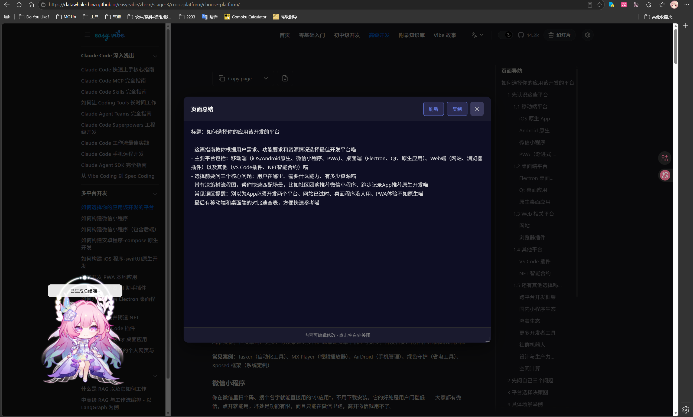

# Live2D 鐪嬫澘濞樻祻瑙堝櫒鎻掍欢




鍩轰簬 [live2d-widget](https://github.com/stevenjoezhang/live2d-widget) 寮€鍙戠殑娴忚鍣ㄦ墿灞曪紝鏀寔 Chrome銆丒dge 鍜?Firefox

## 鍔熻兘

- 鏀寔 Cubism 2 鍜?Cubism 3 妯″瀷
- 鍏煎 VTS 妯″瀷锛堝姩浣滃拰闊虫晥绛夋柟闈㈣繕娌″仛锛屽彧鏄鍋氬埌浜嗗吋瀹癸紝鍙互鏄剧ず浜嗭級

## 瀹夎

璇︾粏璇风湅鐩綍涓嬬殑 BROWSER_SUPPORT.md

## 椤圭洰缁撴瀯

```
live2d-widget-extension/
鈹溾攢鈹€ manifest.json       # 鎵╁睍閰嶇疆
鈹溾攢鈹€ content.js          # 椤甸潰娉ㄥ叆鑴氭湰
鈹溾攢鈹€ background.js       # 鍚庡彴鑴氭湰
鈹溾攢鈹€ popup.html/js       # 璁剧疆闈㈡澘
 鈹斺攢鈹€ popup2.html/js     # 楂樼骇璁剧疆
鈹溾攢鈹€ dist/               # Live2D 鏍稿績鏂囦欢
鈹溾攢鈹€ lemon-tab/          # 鏂版爣绛鹃〉
鈹溾攢鈹€ live2d-static-api/  # Cubism 妯″瀷绱㈠紩
 鈹溾攢鈹€ models_Cubism2     # Cubism 2 妯″瀷
 鈹斺攢鈹€ models_Cubism3     # Cubism 3 妯″瀷
鈹溾攢鈹€ live2d-moc3/        # Cubism 3 璋冪敤搴?
鈹斺攢鈹€ live2d-ai/          # AI 瀵硅瘽鍔熻兘
```

## 鏇存柊鏃ュ織
### v1.0.4-beta-2
- 淇 Cubism2 鏈湴妯″瀷鍔犺浇闂锛堝吋瀹?杩欑帺鎰忓お鑰佷簡鍑嗗鑸嶅純锛?
- 淇 settingsData 鍙橀噺浣滅敤鍩熼棶棰?
- 鍦?lemon-tab 榛樿鍥炬爣閰嶇疆涓坊鍔?GitHub 鍜?UAPI 鍥炬爣

### v1.0.4-beta-1
- AI 鑱婂ぉ鍔熻兘瀹屽杽锛屾敮鎸?DeepSeek 鍜岀鍩烘祦鍔?API
- 娣诲姞瑙掕壊淇℃伅閰嶇疆锛堝鍚嶃€佸枩娆€佸叧绯汇€佽鑹茶瀹氥€侀檺鍒讹級
- 鐐瑰嚮妯″瀷瑙﹀彂鎶氭懜浜や簰锛堟尃浣犮€佹懜鎽搞€佹崗鎹忕瓑锛?
- 浠?`live2d-ai/json/` 鏂囦欢澶硅嚜鍔ㄨ鍙?API Key 鍜岃鑹查厤缃?
- 娣诲姞杩炴帴鐘舵€佹樉绀哄拰鑷姩閲嶈繛鍔熻兘
- 杈撳叆妗嗘敮鎸佷寒鑹?鏆楄壊涓婚
- 浼樺寲璁剧疆鍚屾鏈哄埗

### v1.0.3-alpha
- 妯″瀷澶у皬婊戝潡瀹炴椂鏇存柊锛屾棤闇€鍒锋柊椤甸潰
- 淇Cubism2妯″瀷鎷栨嫿鍔熻兘
- 娣诲姞鎷栨嫿浣嶇疆淇濆瓨鍔熻兘
- 娣诲姞鎷栨嫿闄愪綅锛岄槻姝㈡嫋鍑哄睆骞?
- 姘旀场浣嶇疆鏅鸿兘璋冩暣锛堟牴鎹ā鍨嬪師濮嬩綅缃拰鎷栨嫿浣嶇疆锛?
- 涓婚鍒囨崲浼樺寲锛堟敮鎸佷寒鑹?鏆楄壊/璺熼殢绯荤粺涓婚锛?
- 娣诲姞榻胯疆璁剧疆鎸夐挳锛岃烦杞珮绾ц缃〉闈?
- AI鑱婂ぉ鍔熻兘妗嗘灦鎼缓锛堝緟瀹炵幇锛?
- UI浼樺寲鍜屼慨澶?

### v1.0.2-alpha-2
- 娣诲姞浜嗛紶鏍囩偣鍑荤壒鏁?
- 澧炲姞浜嗛紶鏍囨牱寮忥紙鍔ㄦ€佷负瀹炵幇锛?
- 娣诲姞榧犳爣椤?

### v1.0.2-alpha-1
- 娣诲姞 Cubism2 鐐瑰嚮瑙﹀彂涓€瑷€鍔熻兘
- 浼樺寲 Cubism2 涓婚鍒囨崲鎸夐挳鏍峰紡
- Cubism3 娣诲姞鎮诞绐楀姛鑳?
- 缂╁皬鎮诞绐?50%
- 淇澶氭寮€鍏虫偓娴獥鐨勪綅绉婚棶棰?

### v1.0.1-alpha
- 鏂板 Firefox 娴忚鍣ㄦ敮鎸?
- 鏂板浜壊/鏆楄壊涓婚鍒囨崲
- 浼樺寲姘旀场浣嶇疆鍜屽畾浣?

### v1.0.0-alpha-2
- 瀹屽杽娴忚鍣?API 鍏煎灞?
- 閲嶅啓UI鐣岄潰

### v1.0.0-alpha-1 - 鍒濆鐗堟湰鍙戝竷
- 鏀寔 Chrome 鍜?Edge 娴忚鍣?
- 鏀